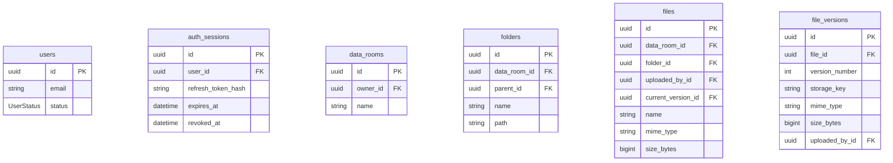
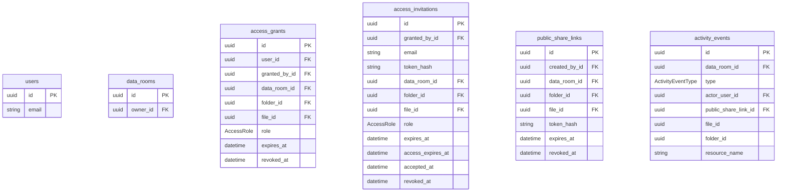

# Database

PostgreSQL stores users, sessions, the folder tree, file metadata, access, and the activity log. PDF bytes are not here: the object lives in storage (disk or R2); the database has only `storage_key`.

In production PostgreSQL is also deployed on Render, next to the NestJS API.

Prisma schema: `apps/nestjs-backend/prisma/schema.prisma`.

## Schema

### Room, folders, files

### Access and activity log

## Tables

**`users`** — account. Login with email and password. Email is always lowercase, password is bcrypt in `password_hash`. `SUSPENDED` is not allowed into the API.

**`auth_sessions`** — server session. The cookie holds the raw token, the table holds SHA-256. Logout sets `revoked_at`.

**`data_rooms`** — data room, the root of “my drive”. A user has exactly one. Created at registration. The owner has full access without a row in `access_grants`.

**`folders`** — a folder in the room. Empty `parent_id` — at the root. `path` is a chain of ancestor UUIDs (`/id/id/`), without names: rename does not rewrite the tree. Folders cannot be moved. Name search uses the same kind of GIN trigram index as files.

**`files`** — a document in a folder or at the room root. Listing looks here. `size_bytes` and `mime_type` are a snapshot of the current version. Re-uploading the same name adds a version, not a second row. Substring search uses a GIN trigram index on `name` (`pg_trgm`), in addition to the listing btree `(data_room_id, folder_id, name, id)`.

**`file_versions`** — one content upload. This is where the object's `storage_key` in storage, version number, size, and MIME live.

**`access_grants`** — access for an already registered user (`VIEWER` / `EDITOR`). Revoke = `revoked_at`, the row is not deleted. Empty `expires_at` — no expiry.

**`access_invitations`** — an invitation to an email while there is no account yet. By itself it does not open the room. After registration or login a grant is created and `accepted_at` is written here. `expires_at` is until when it can be accepted; `access_expires_at` is copied into the grant.

**`public_share_links`** — a public link without an account. Always view-only, no role column. The URL has the raw token, the database has the hash.

**`activity_events`** — room activity log. The API does not update or delete rows. `file_id` / `folder_id` have no foreign key: after a file is deleted the history remains, the name lives in `resource_name`. Only the owner can read it.

`oauth_accounts` and `auth_tokens` exist in Prisma; the product does not use them.

## Access target

A grant, an invite, and a public link share the same target model. A folder and a file cannot be set at the same time.

| `folder_id` | `file_id` | What is covered |
| --- | --- | --- |
| empty | empty | the whole room |
| set | empty | the folder and descendants |
| empty | set | a single file |

## Enums

**`UserStatus`** — account state (`users.status`).

- `ACTIVE` — can sign in
- `SUSPENDED` — the session is no longer let into the API

**`AccessRole`** — role of a grant and an invite (`access_grants.role`, `access_invitations.role`). A public link has no role.

- `VIEWER` — view and download only
- `EDITOR` — can write (upload, rename, move, delete)

**`ActivityEventType`** — type of a log row (`activity_events.type`).

- `FILE_VIEWED` — opened a file
- `FILE_DOWNLOADED` — downloaded a file
- `LINK_OPENED` — opened a public link
- `ACCESS_GRANTED` — granted access
- `ACCESS_REVOKED` — revoked access
- `FILE_DELETED` — deleted a file
- `FOLDER_DELETED` — deleted a folder
