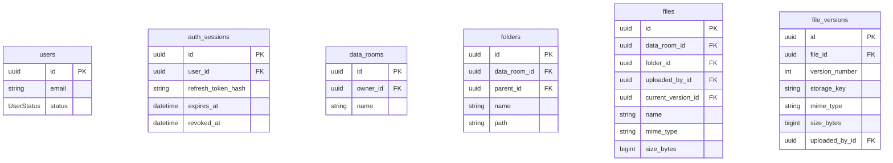
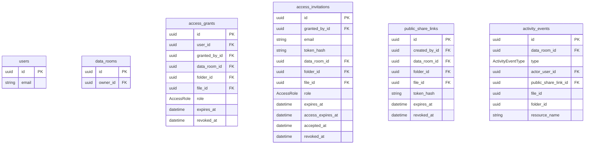

# База данных

PostgreSQL хранит пользователей, сессии, дерево папок, метаданные файлов, доступы и журнал. Байты PDF здесь нет: объект лежит в хранилище (диск или R2), в базе только `storage_key`.

В проде PostgreSQL тоже задеплоен на Render, рядом с NestJS API.

Схема Prisma: `apps/nestjs-backend/prisma/schema.prisma`.

## Схема

### Комната, папки, файлы

### Доступ и журнал

## Таблицы

**`users`** — аккаунт. Вход по email и паролю. Email всегда lowercase, пароль — bcrypt в `password_hash`. `SUSPENDED` не пускает в API.

**`auth_sessions`** — серверная сессия. В cookie сырой токен, в таблице SHA-256. Logout ставит `revoked_at`.

**`data_rooms`** — комната данных, корень «моего диска». У пользователя ровно одна. Создаётся при регистрации. Владелец имеет полный доступ без строки в `access_grants`.

**`folders`** — папка в комнате. `parent_id` пустой — в корне. `path` — цепочка UUID предков (`/id/id/`), без имён: rename не переписывает дерево. Папки перемещать нельзя. Поиск по имени — GIN trigram-индекс, как у файлов.

**`files`** — документ в папке или в корне комнаты. Listing смотрит сюда. `size_bytes` и `mime_type` — снимок текущей версии. Повторный upload того же имени добавляет версию, не вторую строку. Поиск по подстроке — GIN trigram-индекс на `name` (`pg_trgm`), отдельно от btree listing `(data_room_id, folder_id, name, id)`.

**`file_versions`** — одна загрузка содержимого. Здесь `storage_key` объекта в хранилище, номер версии, размер, MIME.

**`access_grants`** — доступ уже зарегистрированному пользователю (`VIEWER` / `EDITOR`). Отзыв = `revoked_at`, строку не удаляют. `expires_at` пустой — бессрочно.

**`access_invitations`** — приглашение на email, пока аккаунта нет. Само по себе комнату не открывает. После регистрации или логина создаётся грант, сюда пишется `accepted_at`. `expires_at` — до какого момента можно принять; `access_expires_at` копируется в грант.

**`public_share_links`** — публичная ссылка без аккаунта. Всегда только просмотр, колонки роли нет. В URL сырой токен, в базе хеш.

**`activity_events`** — журнал комнаты. API строки не обновляет и не удаляет. `file_id` / `folder_id` без внешнего ключа: после удаления файла история остаётся, имя лежит в `resource_name`. Читать может только владелец.

`oauth_accounts` и `auth_tokens` в Prisma есть, продукт их не использует.

## Цель доступа

У гранта, инвайта и публичной ссылки одна и та же модель цели. Папку и файл сразу указать нельзя.

| `folder_id` | `file_id` | Что покрыто |
| --- | --- | --- |
| пусто | пусто | вся комната |
| задан | пусто | папка и потомки |
| пусто | задан | один файл |

## Enums

**`UserStatus`** — состояние аккаунта (`users.status`).

- `ACTIVE` — можно войти
- `SUSPENDED` — сессия больше не пускает в API

**`AccessRole`** — роль гранта и инвайта (`access_grants.role`, `access_invitations.role`). У публичной ссылки роли нет.

- `VIEWER` — только просмотр и скачивание
- `EDITOR` — может писать (загружать, переименовывать, перемещать, удалять)

**`ActivityEventType`** — тип записи в журнале (`activity_events.type`).

- `FILE_VIEWED` — открыли файл
- `FILE_DOWNLOADED` — скачали файл
- `LINK_OPENED` — зашли по публичной ссылке
- `ACCESS_GRANTED` — выдали доступ
- `ACCESS_REVOKED` — отозвали доступ
- `FILE_DELETED` — удалили файл
- `FOLDER_DELETED` — удалили папку
