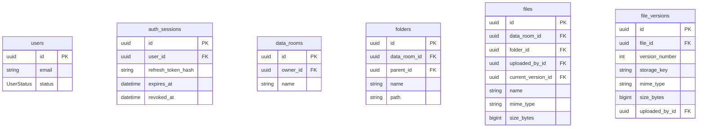
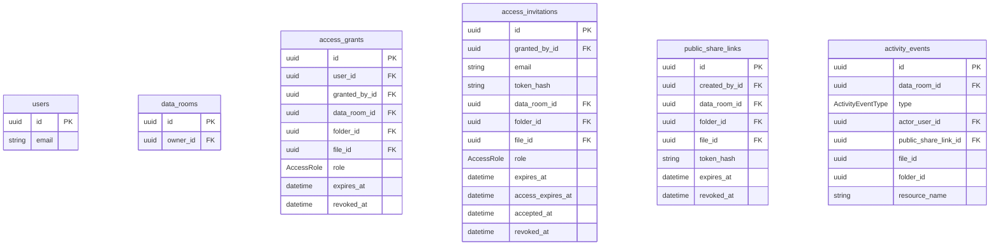

# База даних

PostgreSQL зберігає користувачів, сесії, дерево папок, метадані файлів, доступи й журнал. Байтів PDF тут немає: об’єкт лежить у сховищі (диск або R2), у базі лише `storage_key`.

У проді PostgreSQL теж задеплоєний на Render, поруч із NestJS API.

Схема Prisma: `apps/nestjs-backend/prisma/schema.prisma`.

## Схема

### Кімната, папки, файли

### Доступ і журнал

## Таблиці

**`users`** — обліковий запис. Вхід за email і паролем. Email завжди lowercase, пароль — bcrypt у `password_hash`. `SUSPENDED` не пускає в API.

**`auth_sessions`** — серверна сесія. У cookie сирий токен, у таблиці SHA-256. Logout ставить `revoked_at`.

**`data_rooms`** — кімната даних, корінь «мого диска». У користувача рівно одна. Створюється під час реєстрації. Власник має повний доступ без рядка в `access_grants`.

**`folders`** — папка в кімнаті. `parent_id` порожній — у корені. `path` — ланцюжок UUID предків (`/id/id/`), без імен: rename не переписує дерево. Папки переміщувати не можна. Пошук за ім’ям — GIN trigram-індекс, як у файлів.

**`files`** — документ у папці або в корені кімнати. Listing дивиться сюди. `size_bytes` і `mime_type` — знімок поточної версії. Повторний upload того самого імені додає версію, не другий рядок. Пошук за підрядком — GIN trigram-індекс на `name` (`pg_trgm`), окремо від btree listing `(data_room_id, folder_id, name, id)`.

**`file_versions`** — одне завантаження вмісту. Тут `storage_key` об’єкта в сховищі, номер версії, розмір, MIME.

**`access_grants`** — доступ уже зареєстрованому користувачу (`VIEWER` / `EDITOR`). Відкликання = `revoked_at`, рядок не видаляють. `expires_at` порожній — безстроково.

**`access_invitations`** — запрошення на email, поки облікового запису немає. Само по собі кімнату не відкриває. Після реєстрації або логіну створюється грант, сюди пишеться `accepted_at`. `expires_at` — до якого моменту можна прийняти; `access_expires_at` копіюється в грант.

**`public_share_links`** — публічне посилання без облікового запису. Завжди лише перегляд, колонки ролі немає. В URL сирий токен, у базі хеш.

**`activity_events`** — журнал кімнати. API рядки не оновлює і не видаляє. `file_id` / `folder_id` без зовнішнього ключа: після видалення файла історія лишається, ім’я лежить у `resource_name`. Читати може лише власник.

`oauth_accounts` і `auth_tokens` у Prisma є, продукт їх не використовує.

## Ціль доступу

У гранту, інвайту й публічного посилання одна й та сама модель цілі. Папку й файл одразу вказати не можна.

| `folder_id` | `file_id` | Що покрито |
| --- | --- | --- |
| порожньо | порожньо | вся кімната |
| задано | порожньо | папка і нащадки |
| порожньо | задано | один файл |

## Enums

**`UserStatus`** — стан облікового запису (`users.status`).

- `ACTIVE` — можна увійти
- `SUSPENDED` — сесія більше не пускає в API

**`AccessRole`** — роль гранту й інвайту (`access_grants.role`, `access_invitations.role`). У публічного посилання ролі немає.

- `VIEWER` — лише перегляд і завантаження
- `EDITOR` — може писати (завантажувати, перейменовувати, переміщувати, видаляти)

**`ActivityEventType`** — тип запису в журналі (`activity_events.type`).

- `FILE_VIEWED` — відкрили файл
- `FILE_DOWNLOADED` — завантажили файл
- `LINK_OPENED` — зайшли за публічним посиланням
- `ACCESS_GRANTED` — видали доступ
- `ACCESS_REVOKED` — відкликали доступ
- `FILE_DELETED` — видалили файл
- `FOLDER_DELETED` — видалили папку
